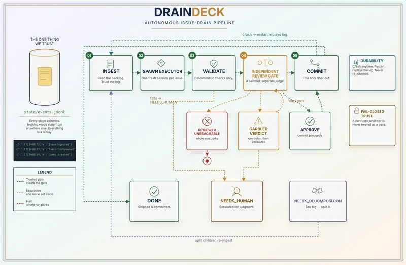

# Draindeck

Draindeck is a local Windows tool that works through an `Issues.md` backlog.
For each issue, it asks a coding agent to make the change, runs your validation
commands, gets an independent review, and commits only approved work.



## Requirements

- Windows, Python 3.12+, and Git
- Claude Code for implementation
- Ollama with a Qwen model for review

## Install

```powershell
git clone https://github.com/AdityaVasireddy/draindeck.git
cd draindeck
py -m venv .venv
.\.venv\Scripts\python.exe -m pip install -e .
Copy-Item config.example.yaml config.local.yaml
```

Edit `config.local.yaml` to set your target repository, branch, validation
command, and Ollama/Qwen settings. Keep this local file out of Git.

## Add issues

Create an `Issues.md` file in the target repository:

```md
## 1: Add a health check

Create a simple health endpoint.

### Acceptance
- The endpoint returns HTTP 200.
- Tests pass.
```

## Run

Check your configuration first:

```powershell
.\.venv\Scripts\python.exe -m runtime.main check-config config.local.yaml
```

Then run Draindeck:

```powershell
.\.venv\Scripts\python.exe -m runtime.main run --config config.local.yaml
```

Use this command after an interrupted run to recover safely without starting
new work:

```powershell
.\.venv\Scripts\python.exe -m runtime.main recover --config config.local.yaml
```

## Import issues (optional)

Generate a local `Issues.md` from another file, GitHub, Jira Cloud, or Linear:

```powershell
draindeck-intake sync issues-md --input C:\source\Issues.md --output C:\target\Issues.md
draindeck-intake sync github --owner OWNER --repo REPO --output C:\target\Issues.md
draindeck-intake sync jira --base-url https://SITE.atlassian.net --jql "project = KEY" --output C:\target\Issues.md
draindeck-intake sync linear --team-key ENG --output C:\target\Issues.md
```

Credentials come from environment variables: `GITHUB_TOKEN`, `JIRA_EMAIL` +
`JIRA_API_TOKEN`, or `LINEAR_API_KEY`.

## Dashboard: one-click launch (recommended)

A single tracked entry point per OS bootstraps everything needed (Python,
`.venv`, the `dashboard` extra), starts exactly one local Dashboard, waits
for it to prove it's actually ready, and only then opens your browser.
System-level or elevated installs (Python via winget/Homebrew/apt, Claude
Code, Ollama) always require your explicit consent first. Separately, as
part of ordinary bootstrap, the entry point may create or update its own
project-local `.venv` and install the `dashboard` extra into it
automatically — this stays local to the project directory, is never
elevated, and never touches your system Python. The browser never opens
against an unverified or foreign process (docs/32).

- **Windows:** double-click `Start-DraindeckDashboard.cmd`, or run it from
  a shell.
- **macOS:** double-click `Start-DraindeckDashboard.command` in Finder
  (grant it "Open" permission if Gatekeeper warns on first run), or run it
  from Terminal.
- **Linux:** `./start-draindeck-dashboard.sh`

The first run may show a consent prompt listing exactly which
system-level prerequisite is missing, where it comes from, and the
command that would install it (winget on Windows, Homebrew on macOS, one
detected native manager — apt/dnf/pacman/zypper — on Linux). Only those
system-level/elevated installs wait for your affirmative accept;
declining makes no install/elevation/model-pull calls at all. The
project-local `.venv`/`dashboard`-extra bootstrap described above is not
gated by this prompt and may still happen automatically. Re-running the
same entry point later reuses a healthy, already-running Dashboard
instead of starting a duplicate.

If the port is already occupied by something the launcher doesn't
recognize as its own, it reports the collision and refuses to start a
duplicate or open a browser against it, rather than guessing.

**Status / stop:** the launcher's own operational state (PID, port, and
an instance-identity token — never a second config file) lives under
`~/.draindeck-dashboard/launcher-state.json`. Run the same entry point
with `--status` or `--stop` (e.g. `.\Start-DraindeckDashboard.cmd --status`)
to check or stop a launcher-owned Dashboard without opening a browser.
Re-running the entry point plainly reports whether it found and reused a
healthy owned process. Both `--stop` and normal reuse act only on a PID
the launcher can verify it owns, via that instance token and
`GET /api/launcher/identity` — it will never stop or reuse a process it
can't prove is its own, even one that happens to be listening on the
expected port.

Dashboard-ready and Run-ready are shown as independent states: the
Dashboard itself can be usable (registering repositories, browsing
history) even while Claude, Ollama, or the configured reviewer model
aren't yet available for actually launching a run.

## Dashboard: manual / advanced

```powershell
.\.venv\Scripts\python.exe -m pip install -e ".[dashboard]"
.\.venv\Scripts\draindeck-dashboard.exe --config dashboard.local.yaml
```

Open <http://127.0.0.1:8420/>.

`draindeck-dashboard` also accepts explicit `--host`/`--port`/`--db-path`/
`--observer-executable` flags in place of `--config` — this is the
in-memory path the one-click launcher itself uses, and it never reads or
writes a config file.

## Important

Draindeck can modify target repositories and make commits. Start with a test
repository, review `config.local.yaml`, and explicitly authorize real runs.

The Dashboard registers and observes repositories read-only by default. Once
a repository's canonical `.draindeck/config.local.yaml` is registered
(`configPath`), the Dashboard can also plan and launch a `draindeck run`
against it directly from the configured-issues page — select one, several,
or every current issue and start a run without a separate terminal. It never
opens or repairs `events.jsonl`, mutates target Git state, or touches the
workspace lease itself; the launched runtime process remains the sole owner
of all of that. See `docs/adr/ADR-30-dashboard-issue-selection-and-run-control.md`.

For full architecture, safety, and provider details, see `docs/` and
`docs/29-draindeck-intake.md`.
